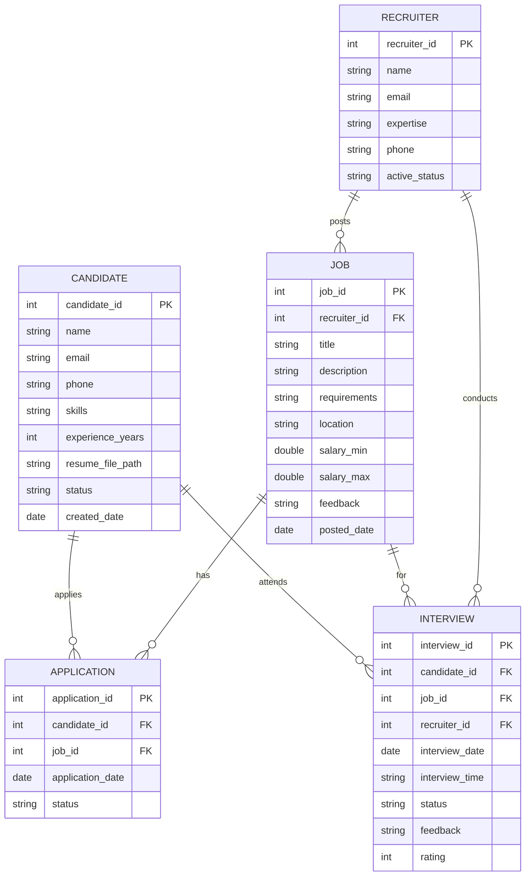

# HireSmart CRM – Recruitment and Candidate Engagement Platform

## Project Overview
HireSmart CRM is a Java-based recruitment and candidate management platform for HireSmart Solutions. It enables efficient management of candidate applications, interview scheduling, recruiter allocation, job postings, and status tracking. The backend is implemented in Java with JDBC and an Oracle database, following OOP and DAO best practices.

## Entity-Relationship Diagram (ERD)
Below is the ER diagram representing the core database structure:



## Features
- **OOP Design**: Abstract `Person` class, `Entity` interface, inheritance for `Candidate` and `Recruiter`
- **DAO Pattern**: Separate DAO classes for each entity
- **CRUD Operations**: Full create, read, update, delete for Candidates, Jobs, Recruiters, Interviews, Applications
- **Menu-driven CLI**: Interactive Java console application for all operations
- **File I/O**: Resume upload simulation via `FileUtil`
- **Date Utilities**: Consistent date handling via `DateUtil`
- **Exception Handling**: Robust error and resource management

## Folder Structure
```
HireSmart-CRM/
├── README.md
├── sql/
│   └── schema.sql
└── src/
    └── com/
        └── hiresmart/
            ├── dao/
            │   ├── CandidateDAO.java
            │   ├── DBConnection.java
            │   ├── InterviewDAO.java
            │   ├── JobDAO.java
            │   └── RecruiterDAO.java
            ├── Main.java
            ├── model/
            │   ├── Application.java
            │   ├── Candidate.java
            │   ├── Interview.java
            │   ├── Job.java
            │   ├── Person.java
            │   ├── Recruiter.java
            │   └── Entity.java
            └── util/
                ├── DateUtil.java
                └── FileUtil.java
```

## Setup Instructions

1. **Database Setup**
   - Connect to your Oracle database.
   - Run `sql/schema.sql` to create all tables and sample data.

2. **Configuration**
   - Update database credentials in `src/com/hiresmart/dao/DBConnection.java`.
   - Ensure the Oracle JDBC driver (e.g., `ojdbc8.jar`) is in your classpath.

3. **Compilation and Execution**
   ```bash
   # Compile Java files
   javac -cp ".:ojdbc8.jar" src/com/hiresmart/**/*.java

   # Run the application
   java -cp ".:ojdbc8.jar:src" com.hiresmart.Main
   ```

## Technologies Used
- **Java 8+**
- **Oracle Database**
- **JDBC**
- **DAO Pattern**

## Authors & Contributions
- Group - 3 
<!-- - ER Diagram: Member 1
- OOP Classes: Member 2
- SQL & CRUD: Member 3
- Collections & Generics: Member 4
- JDBC Integration: Member 5
- Exception Handling & Utilities: Member 6 -->

